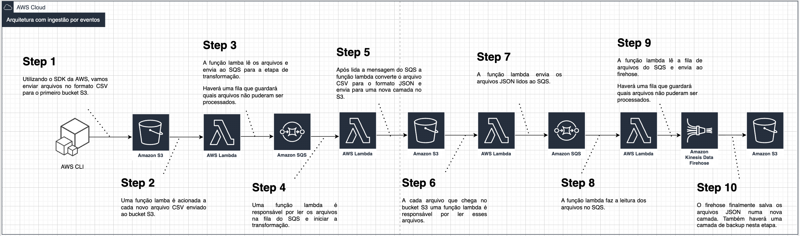

# Resumo
Este projeto faz parte do terceiro solution sprint do **MBA** em Engenharia de Dados da **FIAP**.

O desafio consiste em construir uma pipeline de dados a qual recebe arquivos no formato **CSV** em um *landing bucket* e é convertido para dois formatos de saída: **JSON** e **PARQUET**. Ao final, os dados foram analisados no ***AWS Athena*** utilizando queries **SQL**.

O dataset escolhido para o projeto está disponível no **Kaggle** através desse link [Seattle Library Collection Inventory](https://www.kaggle.com/datasets/city-of-seattle/seattle-library-collection-inventory)

Os arquivos **CSV** foram separados em arquivos menores de **50.000** linhas. Foram utilizados **10** arquivos para testar a arquitetura em funcionamento.

# Arquitetura

O provedor de cloud público utilizado foi a **AWS**. Os serviços propostos para construir o pipeline, desenho da arquitetura de dados e explicação dos códigos estão logo abaixo:

- ## Desenho das arquiteturas




-  ## Serviços

	-  *AWS Simple Queue Service*: O Amazon *Simple Queue Service* (**SQS**) é um serviço de filas de mensagens gerenciado que permite o desacoplamento e a escalabilidade de microsserviços, sistemas distribuídos e aplicações sem servidor.

	-  *AWS Lambda*: O *AWS Lambda* é um serviço de computação sem servidor e orientado a eventos que permite executar código para praticamente qualquer tipo de aplicação ou serviço de backend sem provisionar ou gerenciar servidores.

	-  *Amazon Simple Storage Service*: O *Amazon Simple Storage Service* (**Amazon S3**) é um serviço de armazenamento de objetos que oferece escalabilidade, disponibilidade de dados, segurança e performance líderes do setor.

	-  *AWS Glue*: O *AWS Glue* é um serviço de integração de dados sem servidor que facilita descobrir, preparar e combinar dados para análise, machine learning e desenvolvimento de aplicações. O *AWS Glue* oferece todos os recursos necessários para a integração dos dados, e assim é possível começar a analisar seus dados e usá-los em minutos, em vez de meses.

	-  *Amazon Athena*: O *Amazon Athena* é um serviço de consultas interativas que facilita a análise de dados no *Amazon S3* usando **SQL** padrão. O **Athena** não precisa de servidor. Portanto, não há infraestrutura para gerenciar e você paga apenas pelas consultas executadas.

	-	*Amazon Kinesis Data Firehose*: O *Amazon Kinesis Data Firehose* é um serviço para extrair, transformar e carregar (**ETL**) que captura, transforma e entrega de forma confiável dados de transmissão para data lakes, armazenamento de dados e serviços analíticos.

-  ## Frameworks

	-  *Terraform*: O *HashiCorp Terraform* é uma ferramenta de **infraestrutura como código** que permite a você definir recursos locais ou em nuvem através de configurações de fácil leitura que você pode versionar, reutilizar e compartilhar.

	-  *Serverless*: O *Serverless Framework* ajuda no desenvolvimento e deploy de funções *AWS Lambda* e seus recursos necessários dentro da infraestrutura da **AWS**.

					
-  ## Filas no SQS

	-  *ingest-csv-queue*: Fila responsável por receber os eventos disparados manualmente através do script ***manual_pipeline/1_from_s3_to_sqs.py*** ou disparados pela função lambda ***a-from-s3-to-sqs***.

	-  *ingest-csv-queue-dl*: Fila que armazena os eventos que por algum motivo não puderam ser lidos e passados adiante na pipeline. O *threshold* está setado para **50** tentativas.

	-  *raw-json-queue*: Fila responsável por receber os eventos disparados manualmente através do script ***manual_pipeline/3_from_s3_to_sqs.py*** ou disparados pela função lambda ***c-from-s3-to-sqs***.
	-  *raw-json-queue*: Fila que armazena os eventos que por algum motivo não puderam ser lidos e passados adiante na pipeline. O *threshold* está setado para **50** tentativas.

- ## Buckets
	- *abdo6-grupo-k-ci-deploy*: Bucket principal que contém as demais camadas utilizadas para armazenamento e transformação dos arquivos até seu estado final.

	- *abdo6-grupo-k-ci-deploy/ingest_csv*: Bucket para onde os arquivos **CSV** são enviados para processamento manual ou por uma função **Lambda** disparada por eventos.

	- *abdo6-grupo-k-ci-deploy/raw_json*: Bucket para onde os arquivos **CSV** após conversão em **JSON Lines** ficam armazenados.

	- *abdo6-grupo-k-ci-deploy/ingest_json*: Bucket onde o **Firehose** irá armazenar os dados **JSON** que recebe via **PUT**.

	- *abdo6-grupo-k-ci-deploy/parquet*: Bucket que contém a conversão dos arquivos **JSON** que estão em *abdo6-grupo-k-ci-deploy/raw_json* e que são convertidos para o formato **PARQUET**.

-  ## Scripts para ingestão manual

	-  *manual_pipeline/1_from_s3_to_sqs.py*: Script responsável por listar todos objetos no bucket **abdo6-grupo-k-ci-deploy**  com o prefixo ***ingest_csv*** e enviar à fila ***ingest-csv-queue***.

		Exemplo de payload **JSON** enviado à fila:
	 
			{"bucket": "abdo6-grupo-k-ci-deploy", "key":"ingest_csv/library-collection-inventory.00001.csv"}

	-  *manual_pipeline/2_from_sqs_to_s3.py*: Script responsável por ler as mensagens da file ***ingest-csv-queue***, marcá-las como lidas e converter os arquivos ***CSV*** em ***JSON Lines***. Após a conversão, os arquivos são salvos no bucket **abdo6-grupo-k-ci-deploy** com o prefixo ***raw_json***

	-  *manual_pipeline/3_from_s3_to_sqs.py*: Script responsável por listar todos objetos no bucket **abdo6-grupo-k-ci-deploy** com o prefixo ***raw_json*** e enviar à fila ***raw-json-queue***.
	
		 Exemplo de payload JSON enviado à fila:
		 
			 {"bucket": "abdo6-grupo-k-ci-deploy", "key":"raw_json/library-collection-inventory.00001.json"}

	-  *manual_pipeline/4_from_sqs_to_firehose.py*: Script responsável por ler as mensagens da fila ***raw-json-queue***, ler o conteúdo do arquivo **JSON** e enviar um **PUT** ao ***Firehose Delivery Stream***.
	
		Exemplo de payload **JSON** enviado ao **Firehose**:
						
			{"BibNum":2758319,"Title":"The great molasses flood : Boston, 1919 \/ Deborah Kops.","Author":"Kops, Deborah","ISBN":"1580893481, 158089349X, 9781580893480, 9781580893497","PublicationYear":"c2012.","Publisher":"Charlesbridge,","Subjects":"Industrial accidents Massachusetts Boston History 20th century Juvenile literature, Molasses industry Accidents Massachusetts Boston History 20th century Juvenile literature, Alcohol industry Accidents Massachusetts Boston History 20th century Juvenile literature, Floods Massachusetts Boston History 20th century Juvenile literature, Boston Mass History Juvenile literature, Industrial accidents Juvenile literature, Molasses industry Accidents Juvenile literature, Alcohol industry Accidents Juvenile literature, Floods Juvenile literature","ItemType":"jcbk","ItemCollection":"ncnf","FloatingItem":null,"ItemLocation":"swt","ReportDate":"2017-09-01T00:00:00.000","ItemCount":1}


-	## Scripts para ingestão por eventos
	-	*event_oriented_pipeline/step01/handler.py*: Esta função **Lambda** é disparada toda vez que novos arquivos com prefixo ***ingest_csv*** são enviados ao bucket **abdo6-grupo-k-ci-deploy**. O destino da mensagem do evento é a fila ***ingest-csv-queue***.
	-	
		Exemplo de log gerado na função:


            2022-10-06 15:35:57 - AWS Services - INFO - {'Records': [{'eventVersion': '2.1', 'eventSource': 'aws:s3', 'awsRegion': 'us-west-2', 'eventTime': '2022-10-06T15:35:55.843Z', 'eventName': 'ObjectCreated:CompleteMultipartUpload', 'userIdentity': {'principalId': 'AWS:AIDAQDT27ILCDLBEH7RPX'}, 'requestParameters': {'sourceIPAddress': '20.9.22.48'}, 'responseElements': {'x-amz-request-id': 'K90HQRDTE2VRMFZP', 'x-amz-id-2': 'XVS1fZc+i4DTqoljLfPrbVQjyt7nG0aupApNFRZfB5Y1ikS6iQ8EipfiabHYg/eRfetvPxohkl6BOQ+8DGRAh9yt7i+dy6cX'}, 's3': {'s3SchemaVersion': '1.0', 'configurationId': 'a-from-s3-to-sqs-dev-myEventTrigger-10387e5b207ebd2671c0e5fa2ad3b1dc', 'bucket': {'name': 'abdo6-grupo-k-ci-deploy', 'ownerIdentity': {'principalId': 'A18Y78OS65TOJC'}, 'arn': 'arn:aws:s3:::abdo6-grupo-k-ci-deploy'}, 'object': {'key': 'ingest_csv/library-collection-inventory.00006.csv', 'size': 16588334, 'eTag': 'e3d51ed82614e75bdef7b004551a09ae-4', 'sequencer': '00633EF5D962189931'}}}]}


	-	*event_oriented_pipeline/step02/handler.py*: Esta função **Lambda** é disparada toda vez que há novas mensagens na fila ***ingest-csv-queue***. Para cada evento gerado, a função converte o arquivo **CSV** em **JSON** e envia ao bucket **abdo6-grupo-k-ci-deploy** com o prefixo ***raw_json***.
		
		Exemplo de log gerado na função:


			2022-10-06 15:52:03 - AWS Services - INFO - {'Records': [{'messageId': 'a5d0a255-7d2d-4921-aad6-86a7e3e0116d', 'receiptHandle': 'AQEBdR6fiaGybooHayb8WQLu1zGii/1GgzCkLhr4uZnaTVDoNS2K5OZZAzFDs6ROv9bggs3WvcVQ9i467hu3HQxuWWZBrJa8PKu8ncukCpBTM4yI9rlIKOZ6D8JFp3LuiVyUH8bBSJ+jErlK79U46oQAhLT9+N2EON4MrX03sQfZJ5wIMmgzuL/k8N5xH/+ezlK27x1Ti+IdClCUw5kEwXPlS5dcQcrlrEW7cWgXX/kFsihrdJvbI8n3n7Blj3RjzgmEgQrkvcQ/3FuKcl8U74GoFRgbHyqVQIA0ufcaBNJuxQ5oERlohwKnPsgOgBbQEyeDcP9DP9asbZ6RHgvdDgsSOTM4Z1ADAiFURgInZgvJK79sqBiKsJ8bq8j3yrY/JgAouP9mSt9ME9pYSrsNLJFk8w==', 'body': '{"Id": "9254896a-458c-11ed-abc3-de3802c30aab", "MessageBody": {"bucket": "abdo6-grupo-k-ci-deploy", "key": "ingest_csv/library-collection-inventory.00002.csv"}}', 'attributes': {'ApproximateReceiveCount': '11', 'SentTimestamp': '1665070557154', 'SenderId': 'AROAQDT27ILCOX2H74HHJ:a-from-s3-to-sqs-dev-myEventTrigger', 'ApproximateFirstReceiveTimestamp': '1665070557154'}, 'messageAttributes': {}, 'md5OfMessageAttributes': None, 'md5OfBody': '02e2cdc36858790c34a24d233286c9fb', 'eventSource': 'aws:sqs', 'eventSourceARN': 'arn:aws:sqs:us-west-2:007774094020:ingest-csv-queue', 'awsRegion': 'us-west-2'}]}
			
	- *event_oriented_pipeline/step03/handler.py*: Esta função **Lambda** é disparada toda vez que um novo arquivo **JSON** chega ao bucket **abdo6-grupo-k-ci-deploy** com o prefixo ***raw_json*** e é enviado para a fila ***raw-json-queue***.
	
        Exemplo de log gerado pela função: 
		            
            2022-10-06 15:52:09 - AWS Services - INFO - {'Records': [{'eventVersion': '2.1', 'eventSource': 'aws:s3', 'awsRegion': 'us-west-2', 'eventTime': '2022-10-06T15:52:08.721Z', 'eventName': 'ObjectCreated:Put', 'userIdentity': {'principalId': 'AWS:AROAQDT27ILCIT5TTMLGL:b-from-sqs-to-s3-dev-myEventTrigger'}, 'requestParameters': {'sourceIPAddress': '44.234.38.201'}, 'responseElements': {'x-amz-request-id': 'HE4KQ07Q9DW8W201', 'x-amz-id-2': '32sGMLQJNuH2oAoUq5PVKMNpe06VPtHFAJxC/0RPiAR5ux0nlAQUhdoJ/Bu7MW7J266yRvbQ6+H+e8enWIZSsH1CjmMocvH2'}, 's3': {'s3SchemaVersion': '1.0', 'configurationId': 'c-from-s3-to-sqs-dev-myEventTrigger-9e6e1d79c97622e0ce19ee216584faff', 'bucket': {'name': 'abdo6-grupo-k-ci-deploy', 'ownerIdentity': {'principalId': 'A18Y78OS65TOJC'}, 'arn': 'arn:aws:s3:::abdo6-grupo-k-ci-deploy'}, 'object': {'key': 'raw_json/library-collection-inventory.00006.json', 'size': 25375649, 'eTag': 'a14254b2eb73ae6721b2c4761af3e0c2', 'sequencer': '00633EF9A8800724F3'}}}]}

	- *event_oriented_pipeline/step04/handler.py*	: Esta função **Lambda** é disparada toda vez que novas mensagens chegam na fila ***raw-json-queue***. O conteúdo do arquivo **JSON** é enviado por método **PUT** ao **Firehose Delivery Stream**. 

		Exemplo de log gerado pela função:
				
			2022-10-06 16:30:49 - AWS Services - INFO - {'Records': [{'messageId': '932f65d1-3032-48e7-9c00-22f5dfcc6f83', 'receiptHandle': 'AQEBQjkUAyuq4LXVbSf0etu5s681bAOZ4k7qZdGik0GOwkiU+ohklkYJSUJ8rNKkd85LpQPwNx0DNUhrHjLZMdRtR38uUzjCMg9dPBdIlHW3Z/yJG4Ek1ItgZ4e3fREVL9ehYXVuwHHq96TmeoSDW5r3W6qJirAelI0jtyWnmnhG6kTcqvqpymvscuw08y9jOxSRez0aATgNCXfDAXr474lZL1X05NXsJ1NYUGYLbraXV29rTIyN9rRbpApa8P6C2Qj6MY7IpBcPP3wGGKqgZ8GeQmFk/CehvFFMe762T7RtpmZAx7B1uu8BF64mjJ+seRxQEdXazJyKvf+GrQBNaxFRhV3mWC1rTFDaDlUvqIM8G0UPd4lrbZMh0e4jaOt41ddEWxcSu8uDQsg/f221PgFXAw==', 'body': '{"Id": "d5d1b53a-458e-11ed-a11a-aa27359b1b2b", "MessageBody": {"bucket": "abdo6-grupo-k-ci-deploy", "key": "raw_json/library-collection-inventory.00007.json"}}', 'attributes': {'ApproximateReceiveCount': '25', 'SentTimestamp': '1665071529336', 'SenderId': 'AROAQDT27ILCLOBJSQZWY:c-from-s3-to-sqs-dev-myEventTrigger', 'ApproximateFirstReceiveTimestamp': '1665071529336'}, 'messageAttributes': {}, 'md5OfMessageAttributes': None, 'md5OfBody': '143a734c04683b59fbbb50b3d1c68fbd', 'eventSource': 'aws:sqs', 'eventSourceARN': 'arn:aws:sqs:us-west-2:007774094020:raw-json-queue', 'awsRegion': 'us-west-2'}]}


- ## Kinesis Data Firehose
	O Firehose recebe o streaming de dados tanto pela ingestão manual quanto pela ingestão por eventos. A configuração foi setada para aguardar 300 segundos ou 5MB de arquivo (o que ocorrer primeiro) e fechar um pacote de dados e enviá-lo ao bucket **abdo6-grupo-k-ci-deploy** no prefixo ***ingest_json***. O armazenamento é feito no formato ***YYYY/MM/DD/H/***

- ## AWS Glue
	- Database criada com o nome **abdo6-grupo-k-ci-deploy**.
	- *Crawlers*: Foi criado um crawler chamado ***raw_json*** para ler o conteúdo dos arquivos JSON no bucket **abdo6-grupo-k-ci-deploy** com prefixo ***raw_json***. Os dados *crawleados* são armazenados em uma ***flat table*** chamada ***raw_json***. Não foi setado *schedule*, por tanto sua frequência é *on-demand*.
	- *Jobs*: O arquivo pyspark ***staging/utilities/transform-to-parquet.py*** é responsável por ler o conteúdo da *flat table* ***raw_json*** e converter o seu conteúdo para o formato **PARQUET** e enviado para o bucket **abdo6-grupo-k-ci-deploy** no prefixo ***parquet***. Após isso, os dados são catalogados em outra *flat table* chamada ***parquet***.

- ## AWS Athena
    Finalmente, chegou o momento de realizar as consultas SQL sobre os dados ingeridos. Aqui fica evidente a eficiência ao armazenar arquivos no formato **PARQUET**. A redução de tamanho foi de aproximadamente **70%**.
    - *flat table* ***raw_json***: 
    
            SELECT COUNT(*) from raw_json;

        O resultado da query é o seguinte:
        

            SELECT * from raw_json;

        O resultado da query é o seguinte:
        
        
    - *flat table* ***parquet***:
            
            SELECT COUNT(*) from parquet;
        
        O resultado da query é o seguinte:
        

            SELECT COUNT(*) from parquet;
        
        O resultado da query é o seguinte:
        

# CI/CD
A parte de entrega contínua e deployment contínuo foi incluída no projeto como parte de um desafio pessoal para o autor. 
- *Terraform*: Os arquivos que gerenciam a infraestrutura na **AWS** estão no diretório ***./staging***. Para que o estado da infraestrutura fosse mantido e não se perdesse a cada deploy, foi necessário criar um *backend* **S3** manualmente na **AWS**. Logo após, a seguinte configuração foi adicionada ao arquivo ***./staging/main.tf***:
	```
	
	terraform {
		backend  "s3" {
		bucket  =  "terraform-ci-deploy"
		key  =  "infra-state"
		region  =  "us-west-2"
		}
	}

- *Serverless Framework*: Para o deploy das funções **Lambda**, foi utilizado o *[Serverless Compose](https://www.serverless.com/framework/docs/guides/compose)*. O arquivo **YAML** de orquestração dos deployments está em ***./event_oriented_pipeline/serverless-compose.yml*** e assim como no Terraform, também foi necessário um *backend* **S3** para guardar os estados das funções **Lambda**.
    ```
        state:
            backend: s3

        services:
            a-from-s3-to-sqs:
                path: step01

            b-from-sqs-to-s3:
                path: step02

            c-from-s3-to-sqs:
                path: step03

            d-from-sqs-to-firehose:
                path: step04


# Contato
[Linkedin](https://linkedin.com/in/nicholascarballo)

# Referências

https://aws.amazon.com/pt/sqs/

https://aws.amazon.com/pt/lambda/

https://aws.amazon.com/pt/glue/

https://aws.amazon.com/pt/athena/

https://aws.amazon.com/pt/kinesis/data-firehose/

https://www.serverless.com/framework/docs/providers/aws/guide/intro

https://www.terraform.io/intro